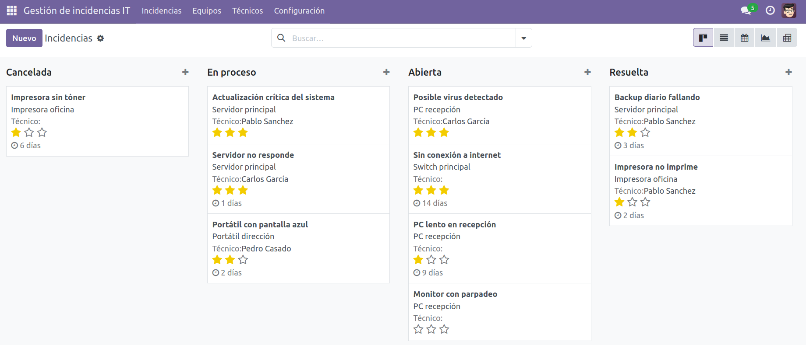
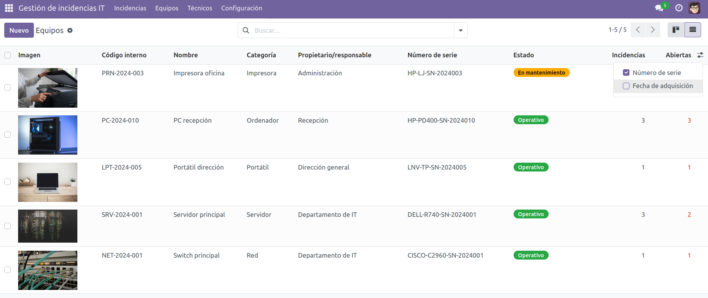
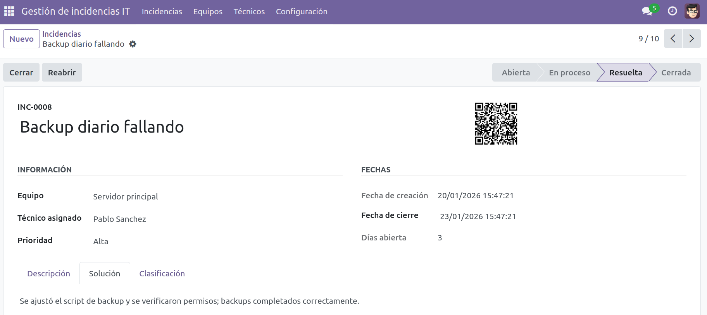
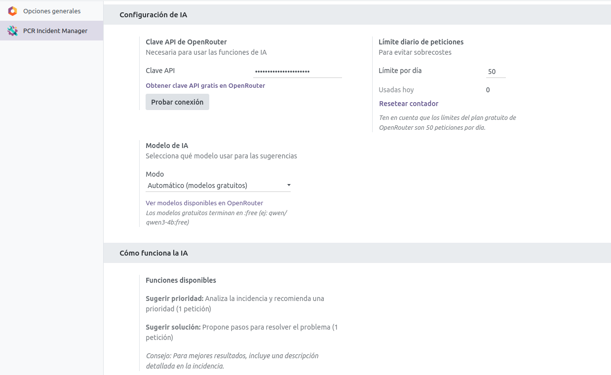

# PCR Incident Manager - Odoo 17

**Gestión inteligente de incidencias IT y mantenimiento con priorización asistida por IA**

Módulo para Odoo 17 que permite gestionar incidencias IT y mantenimiento de equipos. Incluye asistencia de inteligencia artificial para sugerir prioridades y soluciones.

## Características

| Categoría       | Funcionalidades                                                                                             |
| --------------- | ----------------------------------------------------------------------------------------------------------- |
| **Incidencias** | Ciclo de vida completo, prioridades, asignación de técnicos, notificaciones email, códigos QR, informes PDF |
| **Equipos**     | Catálogo con imágenes, estados, asociación a propietarios, historial de incidencias                         |
| **IA**          | Sugerencia de prioridad y solución via OpenRouter, control de uso diario                                    |
| **Vistas**      | Kanban, Calendario, Gráficos, Pivot, Búsqueda avanzada                                                      |
| **Seguridad**   | Grupos Técnico/Administrador, reglas por usuario                                                            |
| **Extras**      | Chatter, multiidioma (ES/EN), datos demo                                                                    |

## Capturas









## Requisitos

- Odoo 17.0
- Módulos dependientes: `base`, `mail`, `contacts`
- (Opcional) `pip install qrcode pillow` para códigos QR
- (Opcional) Clave API de [OpenRouter](https://openrouter.ai/keys) para IA
- Servidor de correo configurado para notificaciones

## Instalación

1. **Descarga el módulo:**

```bash
git clone -b 17.0 https://github.com/ImPavloh/pcr_incident_manager.git
```

O ve a Odoo Apps, busca "PCR Incident Manager" e instálalo directamente desde allí. O haz clic [aquí](https://apps.odoo.com/apps/modules/17.0/pcr_incident_manager) para ir a la página del módulo.

2. **Copia a tu instancia Odoo:**

```bash
cp -r pcr_incident_manager /ruta/a/odoo/addons/
```

3. **Actualiza Odoo:**

En Odoo, ve a **Apps** → **Actualizar lista de aplicaciones** (modo desarrollador activado)

4. **Instala el módulo:**

Busca "PCR Incident Manager" e instala.

También puedes acceder al módulo desde Odoo Apps:

https://apps.odoo.com/apps/modules/17.0/pcr_incident_manager

## Configuración

**IA (opcional):** Incidencias > Configuración > Ajustes → Introduce clave OpenRouter

**Email (opcional):** Ajustes > Técnico > Servidores de correo de salida → Configura SMTP

## Uso

### Flujo de trabajo

```
Abierta → Iniciar → En proceso → Resolver* → Resuelta → Cerrar → Cerrada
```

_\* Requiere solución y técnico asignado_

### Asistencia IA

Desde una incidencia: **Sugerir prioridad** o **Sugerir solución** → Confirmar → Aplicar

## Estructura

```
pcr_incident_manager/
├── data/            # Secuencias y plantillas de correo
├── demo/            # Datos de demostración
├── i18n/            # Traducciones (es, en_US)
├── models/          # Modelos Python (incident, equipment...)
├── report/          # Informes PDF
├── security/        # Grupos, permisos y reglas de acceso
├── static/          # Icono e imágenes
└── views/           # Vistas XML (form, tree, kanban...)
```

## Modelos

| Modelo                                    | Descripción           |
| ----------------------------------------- | --------------------- |
| `pcr_incident_manager.incident`           | Incidencias IT        |
| `pcr_incident_manager.equipment`          | Equipos/Activos       |
| `pcr_incident_manager.equipment_category` | Categorías de equipos |
| `pcr_incident_manager.technician`         | Técnicos              |
| `pcr_incident_manager.incident.type`      | Tipos de incidencia   |
| `pcr_incident_manager.ai.service`         | Servicio de IA        |

## Autor

Desarrollado por [Pavloh](https://pavloh.com)

## Soporte

Para incidencias o sugerencias:

- GitHub: https://github.com/ImPavloh/pcr_incident_manager/issues

## Licencia

Este módulo se distribuye bajo licencia [LGPL-3](./LICENSE).
